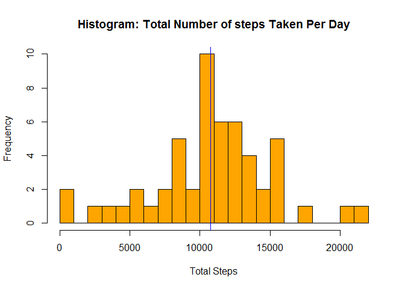
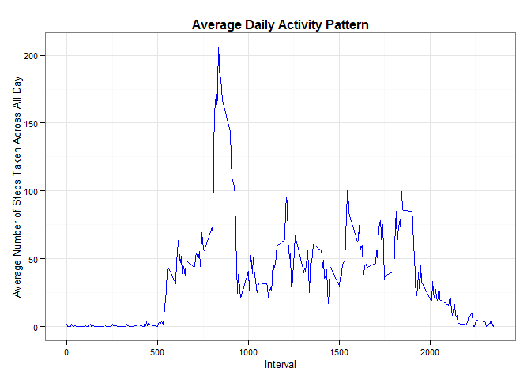

# Reproducible Research: Peer Assessment 1


## Introduction

It is now possible to collect a large amount of data about personal movement using activity monitoring devices such as a Fitbit, Nike Fuelband, or Jawbone Up. These type of devices are part of the "quantified self" movement - a group of enthusiasts who take measurements about themselves regularly to improve their health, to find patterns in their behavior, or because they are tech geeks. But these data remain under-utilized both because the raw data are hard to obtain and there is a lack of statistical methods and software for processing and interpreting the data.

This assignment makes use of data from a personal activity monitoring device. This device collects data at 5 minute intervals through out the day. The data consists of two months of data from an anonymous individual collected during the months of October and November, 2012 and include the number of steps taken in 5 minute intervals each day.

## Loading and preprocessing the data

In this section, we are going to load the supplied data set into a base data frame named
activity_df. This data frame will be used for aggregation through out this exercise.


```r
unzip("./activity.zip")
activity_df <- read.csv("activity.csv")
```

## What is mean total number of steps taken per day?

In order to answer this question, the data set needs to be grouped by date. This is illustrated below:


```r
day_df <- group_by(activity_df,date)
```

Once we have applied the grouping, we can create a data frame with the summarized data on sum of steps taken per day:


```r
total_day <- summarise(day_df, sum_steps=sum(steps))

# Let's check how our data looks like:

total_day
```

```
## Source: local data frame [61 x 2]
## 
##          date sum_steps
## 1  2012-10-01        NA
## 2  2012-10-02       126
## 3  2012-10-03     11352
## 4  2012-10-04     12116
## 5  2012-10-05     13294
## 6  2012-10-06     15420
## 7  2012-10-07     11015
## 8  2012-10-08        NA
## 9  2012-10-09     12811
## 10 2012-10-10      9900
## ..        ...       ...
```

Following code will plot out a histogram on the total number of steps taken each day


```r
hist(total_day$sum_steps, col="orange", breaks=20, main="Histogram: Total Number of steps Taken Per Day", xlab="Total Steps", ylab="Frequency")
```

 

After all, this doesn't really help us to answer the question. If you may recall, we are trying to find out the **mean** total number of steps taken per day. Let's add a mean line to the histogram:


```r
mean1 <- mean(total_day$sum_steps, na.rm=TRUE)

hist(total_day$sum_steps, col="orange", breaks=20, main="Histogram: Total Number of steps Taken Per Day", xlab="Total Steps", ylab="Frequency")
abline(v = mean1, col = "blue", lwd = 1)
```

 

Here's the calculation of **mean and median of the total number of steps taken per day**:

```r
mean(total_day$sum_steps, na.rm=TRUE)
```

```
## [1] 10766.19
```

```r
median(total_day$sum_steps, na.rm=TRUE)
```

```
## [1] 10765
```


## What is the average daily activity pattern?

We can plot a time series line chart to illustrate the average daily activity pattern. Before the chart can be plotted, the data has to be aggregated based on the "interval":


```r
interval_df <- group_by(activity_df,interval)
```

Once we have applied the grouping, we can create a data frame with the summarized data on sum of steps taken per day:


```r
mean_interval <- summarise(interval_df, mean_steps=mean(steps,na.rm=TRUE))

# Let's check how our data looks like:

mean_interval
```

```
## Source: local data frame [288 x 2]
## 
##    interval mean_steps
## 1         0  1.7169811
## 2         5  0.3396226
## 3        10  0.1320755
## 4        15  0.1509434
## 5        20  0.0754717
## 6        25  2.0943396
## 7        30  0.5283019
## 8        35  0.8679245
## 9        40  0.0000000
## 10       45  1.4716981
## ..      ...        ...
```

Following code snippet produces the time series line chart of average number of steps taken across all day:


```r
g2 <- ggplot(mean_interval, aes(interval,mean_steps))
plot2 <- g2 + geom_line(colour="blue") + theme_bw(base_size = 10) + labs(x = "Interval") + labs(y = "Average Number of Steps Taken Across All Day") + ggtitle("Average Daily Activity Pattern") + theme(plot.title = element_text(lineheight=.8, face="bold")) 
plot2
```

 

Fllowing calculation shows which 5-minute interval contains the maximum number of avarage steps:


```r
mean_interval[mean_interval$mean_steps==max(mean_interval$mean_steps),]
```

```
## Source: local data frame [1 x 2]
## 
##   interval mean_steps
## 1      835   206.1698
```

## Imputing missing values


## Are there differences in activity patterns between weekdays and weekends?
